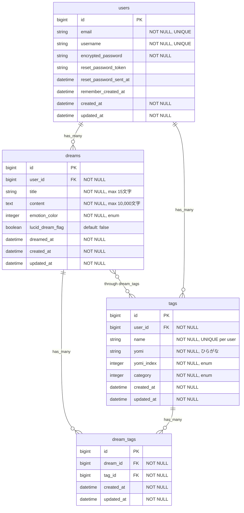

# データ定義

モデルの制約・バリデーション・enumの一元管理ファイル。
**実装時のSource of Truth**。

---

## ER図



---

## モデル定義

### User

ユーザー認証・管理。Devise使用。

| カラム | 型 | 制約 | 説明 |
|--------|-----|------|------|
| email | string | NOT NULL, UNIQUE | メールアドレス |
| username | string | NOT NULL, UNIQUE | ユーザー名 |
| encrypted_password | string | NOT NULL | 暗号化パスワード |
| reset_password_token | string | - | パスワードリセット用トークン |
| reset_password_sent_at | datetime | - | リセット送信日時 |
| remember_created_at | datetime | - | ログイン記憶日時 |

**バリデーション**:
- `username`: presence, uniqueness
- `email`: Deviseが管理（format, presence, uniqueness）
- `password`: Deviseが管理（minimum 6文字）

**アソシエーション**:
- `has_many :dreams, dependent: :destroy`
- `has_many :tags, dependent: :destroy`

**コールバック**:
- `after_create`: チュートリアル本（先代の主の手記）を自動生成
  - タイトル: 「先代の主の手記」
  - 内容: 使い方ガイド（仕様は `screens/list.md` 参照）
  - 感情彩色: peace
  - dreamed_at: ユーザー作成日時

---

### Dream

夢日記の本体データ。

| カラム | 型 | 制約 | 説明 |
|--------|-----|------|------|
| user_id | bigint | NOT NULL, FK | ユーザーID |
| title | string(15) | NOT NULL | 夢のタイトル |
| content | text | NOT NULL | 夢の本文 |
| emotion_color | integer | NOT NULL | 感情彩色（enum） |
| lucid_dream_flag | boolean | default: false | 明晰夢フラグ（将来拡張：データ構造のみ確保、UI未実装） |
| dreamed_at | datetime | NOT NULL | 夢を見た日 |

**バリデーション**:
- `title`: presence, length { maximum: 15 }
- `content`: presence, length { maximum: 10_000 }
- `dreamed_at`: presence
- `emotion_color`: presence

**enum: emotion_color**:
| 値 | integer | 表示名 | 色 |
|----|---------|--------|-----|
| peace | 0 | 平穏 | 青系 |
| chaos | 1 | 混沌 | 赤系 |
| fear | 2 | 恐怖 | 紫系 |
| elation | 3 | 高揚 | 黄系 |

**アソシエーション**:
- `belongs_to :user`
- `has_many :dream_tags, dependent: :destroy`
- `has_many :tags, through: :dream_tags`

**スコープ**:
- `recent`: dreamed_at降順
- `by_emotion(color)`: 感情彩色でフィルタ
- `search_by_keyword(keyword)`: タイトル・本文検索
- `tagged_with(tag_ids)`: 指定タグを持つ夢

---

### Tag

タグマスター（登場人物・場所）。ユーザーごとに管理。

| カラム | 型 | 制約 | 説明 |
|--------|-----|------|------|
| user_id | bigint | NOT NULL, FK | ユーザーID |
| name | string | NOT NULL, UNIQUE per user | タグ名（元の表記） |
| yomi | string | NOT NULL | 読み仮名（ひらがな） |
| yomi_index | integer | NOT NULL | 五十音インデックス（enum） |
| category | integer | NOT NULL | カテゴリ（enum） |

**バリデーション**:
- `name`: presence, uniqueness { scope: :user_id }
- `yomi`: presence
- `category`: presence
- `yomi_index`: presence

**enum: category**:
| 値 | integer | 説明 |
|----|---------|------|
| person | 0 | 登場人物 |
| place | 1 | 場所 |

**enum: yomi_index**:
| 値 | integer | 対応する読み |
|----|---------|--------------|
| あ | 0 | あ行（あ〜お） |
| か | 1 | か行（か〜ご） |
| さ | 2 | さ行（さ〜ぞ） |
| た | 3 | た行（た〜ど） |
| な | 4 | な行（な〜の） |
| は | 5 | は行（は〜ぽ） |
| ま | 6 | ま行（ま〜も） |
| や | 7 | や行（や〜よ） |
| ら | 8 | ら行（ら〜ろ） |
| わ | 9 | わ行（わ〜ん） |
| 英数字 | 10 | A-Z, 0-9 |
| 他 | 11 | その他 |

**アソシエーション**:
- `belongs_to :user`
- `has_many :dream_tags, dependent: :destroy`
- `has_many :dreams, through: :dream_tags`

**スコープ**:
- `by_category(cat)`: カテゴリでフィルタ
- `by_yomi_index(idx)`: 五十音インデックスでフィルタ
- `search_by_name_or_yomi(query)`: タグ名・読み仮名で検索

---

### DreamTag

DreamとTagの多対多関係（中間テーブル）。

| カラム | 型 | 制約 | 説明 |
|--------|-----|------|------|
| dream_id | bigint | NOT NULL, FK | 夢日記ID |
| tag_id | bigint | NOT NULL, FK | タグID |

**バリデーション**:
- `dream_id`: uniqueness { scope: :tag_id }（同じ組み合わせは1つのみ）

**アソシエーション**:
- `belongs_to :dream`
- `belongs_to :tag`

---

## クライアント側データ

### LocalStorage: 殴り書きメモ

トップページで入力した一時メモ。夢から覚めた直後に素早くメモし、後で正式な夢日記として保存するための機能。

#### トップページ時点

| キー | 値 | 説明 |
|------|-----|------|
| `scratch_memo` | JSON文字列 | 殴り書きメモの内容 |

**構造**:
```json
{
  "content": "入力されたテキスト",
  "timestamp": 1234567890
}
```

#### 作成画面で拡張後

作成画面を開く際、トップページからの値を継承して以下の構造に拡張されます。

**構造**:
```json
{
  "title": "タイトル",
  "dreamed_at": "2024-01-01",
  "content": "本文",
  "emotion_color": "peace",
  "tags": [
    {"name": "太郎", "yomi": "たろう", "category": "person"},
    {"name": "公園", "yomi": "こうえん", "category": "place"}
  ],
  "lucid_dream_flag": false,
  "timestamp": 1234567890
}
```

#### 編集画面（別キー）

| キー | 値 | 説明 |
|------|-----|------|
| `draft_dream_edit_{id}` | JSON文字列 | 編集中の夢日記の下書き |

**構造**: 作成画面の拡張後と同様

**ライフサイクル**:
- **トップページ**: 入力時に自動保存
- **ログイン/サインアップ時**: 保持したまま遷移
- **作成画面遷移時**: 殴り書きメモがあれば本文に自動入力（タイムスタンプ比較）
- **夢日記保存成功時**: LocalStorageから削除
- **編集画面**: `draft_dream_edit_{id}` として別キーで保存（保存成功時または閉じる時に削除）
